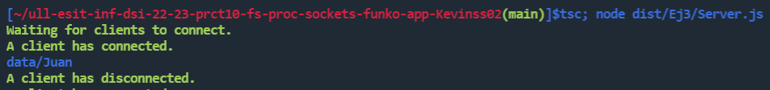

# Ejercicio 2 - Contador de líneas, palabras y caracteres en ficheros de texto desde la línea de comandos

## Enunciado

El objetivo es crear una aplicación que permita contar líneas, palabras y caracteres de un fichero de texto, recibiendo la ruta del archivo como parámetro desde la línea de comandos. Además, se debe poder indicar desde la línea de comandos qué información se desea mostrar. Se pide implementar el ejercicio de dos formas diferentes: usando el método pipe de un Stream y creando subprocesos sin usar pipe, registrando los manejadores necesarios para implementar la funcionalidad.

## Implementación

```
import {existsSync} from 'fs'; 
import yargs from 'yargs';
import chalk from "chalk"
import { spawn } from 'child_process';
import { hideBin } from 'yargs/helpers';

const argv = yargs(hideBin(process.argv))
  .usage(chalk.blue('Usage: $0 [options] filename'))
  .example(chalk.green('$0 -lwc file.txt'), 'Count lines, words and characters in file.txt')
  .options({
    l: { type: 'boolean', describe: 'Count number of lines' },
    w: { type: 'boolean', describe: 'Count number of words' },
    c: { type: 'boolean', describe: 'Count number of characters' },
    p: { type: 'boolean', describe: 'Using pipe Stream Method'},
  })
  .demandCommand(1, chalk.red('Filename is required'))
  .parseSync()

const filename = argv._[0].toString();
const countLines = argv.l;
const countWords = argv.w;
const countChars = argv.c;
const pipeMethod = argv.p;

if (filename) {
  if (!existsSync(filename)) {
    console.error(chalk.red(`File ${filename} does not exist`));
    process.exit(1);
  }
}

const wcArgs = [];
if (countLines) wcArgs.push('-l');
if (countWords) wcArgs.push('-w');
if (countChars) wcArgs.push('-c');

if (wcArgs.length === 0) {
  console.error(chalk.red('Please specify at least one of this option (-l, -w, -c)'));
  process.exit(1);
}

const wc = spawn('wc', wcArgs.concat(filename));

if (pipeMethod) { 
  wc.stdout.pipe(process.stdout); 
} else {
  let wcOutput = '';
  wc.stdout.on('data', (piece) => wcOutput += piece);
  wc.on('close', () => {
    let wcOutputAsArray = wcOutput.split(/\s+/).slice(0, -2);
    if (wcOutputAsArray[0]) console.log(`File helloworld.txt has ${wcOutputAsArray[0]} lines`);
    if (wcOutputAsArray[1]) console.log(`File helloworld.txt has ${wcOutputAsArray[1]} words`);
    if (wcOutputAsArray[2]) console.log(`File helloworld.txt has ${wcOutputAsArray[2]} characters`);
  });
}
```

Para implementar este ejericicio se ha utilizado yargs con las siguiente opciones: -l para contar líneas, -w para contar palabras, -c para contar caracteres, y -p para indicar si se quiere usar el método pipe de un Stream para redirigir la salida de un comando hacia otro.

El programa comprueba que se haya pasado un nombre de archivo como parámetro y si existe ese archivo. Si no existe, se muestra un mensaje de error y se interrumpe la ejecución.

Se utiliza spawn del módulo child_process de node para ejecutar el comando wc que permite contar líneas, palabras y caracteres. Si se indicó la opción -p, se usa el método pipe para redirigir la salida de wc hacia la salida estándar del proceso actual. Si no se usó el método pipe, se registra un manejador de eventos para procesar la salida del comando wc y mostrar la información solicitada.

## Ejemplo de ejecución


# Ejercicio 3 - Cliente y servidor para aplicación de registro de Funko Pops

## Enunciado

Se deberá implementar un servidor y un cliente que usen sockets utilizando el módulo net de Node.js para la aplicación de registro de Funko Pops de la práctica anterior. El cliente solicita las mismas operaciones que se implementaron, y la información se deberá almacenar en ficheros JSON en el sistema de ficheros del servidor. El usuario interactúa con el cliente a través de la línea de comandos utilizando yargs.

## Implementación - Novedades

Los ficheros Funko.ts y FunkoCollectionManager.ts propios de la práctica 9 y que incluyen la implementación de clases y operaciones del objeto Funko no han sido prácticamente modificados. El único cambio que se ha realizado es que el resultado de las operaciones (add, update, show...) ya no imprime el resultado por pantalla. En su lugar estas funciones devuelven una string con el resultado que será recogido por el servidor para enviarlo como respuesta al cliente en formato JSON.

## Clase messageEventEmitter

```
import net from 'net';
import { EventEmitter } from 'events';

export type messageEventEmitterTypeOptions = {
  emitterType: 'client' | 'server';
}

export class MessageEventEmitter extends EventEmitter {
  constructor(public connection: net.Socket, public emitterType?: messageEventEmitterTypeOptions) {
    super();

    let wholeData = '';
    connection.on('data', (dataChunk) => {
      wholeData += dataChunk;

      let messageLimit = wholeData.indexOf('\n');
      while (messageLimit !== -1) {
        const message = wholeData.substring(0, messageLimit);
        wholeData = wholeData.substring(messageLimit + 1);
        if (this.emitterType?.emitterType === 'client') {
          this.emit('response', JSON.parse(message));
        } else if (this.emitterType?.emitterType === 'server') {
          this.emit('request', JSON.parse(message));
        } else {
          this.emit('message', JSON.parse(message));
        }
        messageLimit = wholeData.indexOf('\n');
      }
    });
  }

  public write(type: string, message?: string) {
    this.connection.write(JSON.stringify({ type: type, message: message }) + '\n');
  }
}
```
La clase MessageEventEmitter extiende de la clase EventEmitter de Node.js. Esta clase se utiliza para leer y escribir mensajes JSON en un socket de red (ya sea de un cliente o un servidor). La clase MessageEventEmitter se inicializa con un objeto connection de tipo net.Socket y una cadena emitterType que puede ser 'client' o 'server', esto es importante porque según esta configuración se enviarán eventos tipo 'request' o 'response'.

En el constructor de la clase, se escucha el evento data en el socket de red. Cada vez que se recibe un fragmento de datos, se agrega al final de una cadena wholeData que contiene los datos completos recibidos hasta el momento. Luego, se busca el índice del carácter de nueva línea ('\n') en la cadena wholeData. Si se encuentra, se extrae el mensaje JSON desde el principio de la cadena hasta el índice del carácter de nueva línea y se emite un evento ('response', 'request' o 'message') dependiendo del tipo de emisor definido con emitterType.

También tiene un método write que se utiliza para enviar mensajes JSON al socket de red. Este método toma dos argumentos: una cadena type y una cadena message. El método convierte estos argumentos en un objeto JSON y lo envía al socket de red con un carácter de nueva línea al final.

## Servidor de la aplicación

```
import net from 'net';
import chalk from 'chalk';
import { MessageEventEmitter, messageEventEmitterTypeOptions} from './messageEventEmitter.js';
import { FunkoCollectionManager } from './FunkoCollectionManager.js';
import { Funko, FunkoGenre, FunkoType } from './Funko.js';

net.createServer((socket) => {
    const emitterType: messageEventEmitterTypeOptions = { emitterType: 'server'}
    const server = new MessageEventEmitter(socket, emitterType);
    console.log(chalk.green('A client has connected.'));

    server.write("validConnection");

    server.on('request', (request) => {
      try {  
        const inputMessage = JSON.parse(request.message.toString());
        const manager = new FunkoCollectionManager(inputMessage.user);
  
        if (request.type === 'add') {
          const newFunko = new Funko("", "", "", FunkoType.POP, FunkoGenre.ANIMATION, "", 0, false, "", 0).parse(inputMessage.funkoData);
          const outputMessage = manager.addFunko(newFunko);
          server.write('add', JSON.stringify({output: outputMessage}));
        } else if (request.type === 'update') {
          const newFunko = new Funko("", "", "", FunkoType.POP, FunkoGenre.ANIMATION, "", 0, false, "", 0).parse(inputMessage.funkoData);
          const outputMessage = manager.modifyFunko(inputMessage.funkoID, newFunko);
          server.write('update', JSON.stringify({output: outputMessage}));
        } else if (request.type === 'read') {
          const outputMessage = manager.showFunko(inputMessage.funkoID);
          server.write('read', JSON.stringify({output: outputMessage}));
        } else if (request.type === 'list') {
          const outputMessage = manager.listFunkos();
          server.write('list', JSON.stringify({output: outputMessage}));
        } else if (request.type === 'remove') {
          const outputMessage = manager.removeFunko(inputMessage.funkoID);
          server.write('remove', JSON.stringify({output: outputMessage}));
        } else {
          console.log(chalk.red(`Invalid request type ${request.type}`));
        }
        server.connection.end();
      } catch (error) {
        console.error(chalk.red(`Invalid JSON message received: ${request.message.toString()}`));
        server.write('error', JSON.stringify({output: chalk.red(`Invalid JSON message sended: ${request.message.toString()}`)}));
        server.connection.end();
      }
    });

    server.connection.on('close', () => {
      console.log(chalk.green('A client has disconnected.'));
    });
  }).listen(60300, () => {
    console.log(chalk.green('Waiting for clients to connect.'));
});
```

Este servidor de red estará escuchando el puerto 60300. Cuando se establece una conexión, el servidor crea una nueva instancia de MessageEventEmitter, que hereda de la clase EventEmitter, para gestionar los eventos y mensajes que se envían y reciben entre el cliente y el servidor.

El servidor responde con un mensaje "validConnection" cuando se establece la conexión. Luego, espera mensajes entrantes del cliente (eventos de tipo 'request', que son de tipo JSON y contiene información sobre las operaciones que el cliente solicitará realizar.

Cuando se recibe una 'request', se crea una instancia de FunkoCollectionManager y se realiza la operación correspondiente en la colección de figuras de Funko. Luego se envía una respuesta de vuelta al cliente con los resultados de la operación.

Si se produce un error al analizar el mensaje JSON o al procesar la operación solicitada, el servidor envía una respuesta de error al cliente y cierra la conexión. Si la operación se realiza correctamente, se cierra la conexión después de enviar la respuesta al cliente. En cualquier caso el servidor seguirá estando activo escuchando el puerto en busca de nuevas conexiones entrantes.

## Cliente de la aplicación

```
import {connect} from 'net';
import yargs from 'yargs';
import chalk from 'chalk';
import { hideBin } from 'yargs/helpers';
import { IFunkoData } from './Funko.js';
import {MessageEventEmitter, messageEventEmitterTypeOptions} from './messageEventEmitter.js';

const emitterType: messageEventEmitterTypeOptions = { emitterType: 'client' }
const client = new MessageEventEmitter(connect({port: 60300}), emitterType);


client.on('error', (error) => {
  console.error(chalk.red('Error in client connection:'), error);
});

client.on('response', (response) => {
  if (response.type === 'validConnection') {
    console.log(chalk.green(`Connection established`));
  } else if (response.type === 'add' || 'update' || 'remove' || 'read' || 'list') { 
    const output = JSON.parse(response.message.toString());
    console.log(output.output);
  } else {
    console.error(chalk.red(`Message type ${response.type} is not valid`));
  }
});

const argv = yargs(hideBin(process.argv)) 
...
```

El cliente es una aplicación que utiliza la línea de comandos mediante yargs para interactuar con el servidor y el sistema de Funkos que este almacena. A través de la línea de comandos el usuario podrá agregar, actualizar, eliminar, leer o listar elementos Funko del sistema.

El cliente es también un objeto de MessageEventEmitter, en este caso el emitterType es 'client'. Al instanciar el cliente se pasa como argumento un net.Socket resultado de conectarse al puerto 60300.

Cuando se recibe una respuesta del servidor, la aplicación verifica el tipo de mensaje recibido. Si es "validConnection", se muestra un mensaje de conexión exitosa en verde. Si el tipo de mensaje es "add", "update", "remove", "read" o "list", se analiza la respuesta, que está en formato JSON, y se muestra el resultado. Si el tipo de mensaje no es uno de los anteriores, se muestra un mensaje de error en rojo.

## Ejemplo de ejecución

Servidor



Cliente


# Ejercicio PE 

## Enunciado

El enunciado de este ejercicio solicitaba la creación de un cliente / servidor cuyo funcionamiento consitiría en que el cliente sea capaz de nviar un comando como mensaje JSON a través de un socket y el servidor se encargue de ejecutarlo y devolver al cliente el resultado de la ejecución.

## Implementación

## Clase MessageEventEmitterClient

Esta clase extiende de la clase EventEmitter de Node.js, lo que significa que hereda todas las capacidades de la clase EventEmitter y puede emitir y escuchar eventos.

El constructor de la clase toma un argumento connection que es también una instancia de la clase EventEmitter. Dentro del constructor, se define una variable wholeData como una cadena vacía. Se registra un manejador de eventos en el objeto connection para el evento data. Cada vez que se emite el evento data, el manejador de eventos concatena los datos en la variable wholeData.

La función general de esta clase es crear un mecanismo para recibir y procesar mensajes a través de una conexión de red. La clase se encarga de concatenar los datos recibidos en la conexión hasta que se complete un mensaje completo y luego emite un evento message con el mensaje completo como argumento.

## Servidor 

```
import net from "net";
import { spawn } from "child_process";
import {MessageEventEmitterClient} from './eventEmitterClient.js';

net.createServer((connection) => {
    console.log("A client has connected.");

    connection.write(JSON.stringify({ type: "ready" }) + "\n");

    let commandString = '';
    connection.on("data", (dataJSON) => {
      commandString = dataJSON.toString();
      console.log(commandString);
    });

    const command = spawn("cat", ["-n", "a.txt"]); // CommandString here

    let output = "";
    command.stdout.on("data", (piece) => {
      output = piece.toString();
    });

    command.on("close", () => {
      connection.write(
        JSON.stringify({
          type: "commandOutput",
          output: output,
        }) + "\n"
      );
    });

    connection.on("close", () => {
      console.log("A client has disconnected.");
    });
  })
  .listen(60300, () => {
    console.log("Waiting for clients to connect.");
  });
```

## Cliente

```
import {connect} from 'net';
import {MessageEventEmitterClient} from './eventEmitterClient.js';

if (process.argv.length < 3) {
  console.log('Please, provide a valid command.');
} else {
  let command = '';
  for (let i = 0; i < process.argv.length - 2; i++) {
    if (i === process.argv.length - 1) { command += process.argv[i + 2]; }
    else { command += process.argv[i + 2] + " "; }
  }

  console.log(command);

  const client = new MessageEventEmitterClient(connect({port: 60300}));

  client.emit('data', command);
  
  client.on('message', (message) => {
    if (message.type === 'ready') {
      console.log(`Connection established.`);
    } else if (message.type === 'commandOutput') {
      console.log(`Execution command ${command}`);
      console.log(`Output: \n${message.output}`);
    } else {
      console.log(`Message type ${message.type} is not valid`);
    }
  });
}
```
El cliente recibe como argumento de la línea de comandos el comando que se querrá ejecutar. Luego se crea el socket correspondiente a la conexión con el puerto 60300 y el cliente emite por el socket la información de este comando a ejecutar.

Cuando el servidor envíe una respuesta de tipo message que estará en formato JSON, se imprimirá en pantalla el resultado de la ejecución.

# Referencias
* [Enunciado Práctica](https://ull-esit-inf-dsi-2223.github.io/prct10-fs-proc-sockets-funko-app/)
* [Documentación Net Node.js](https://nodejs.org/docs/latest-v19.x/api/net.html/)
* [Documentación File System Node.js](https://nodejs.org/docs/latest-v19.x/api/fs.html/)
